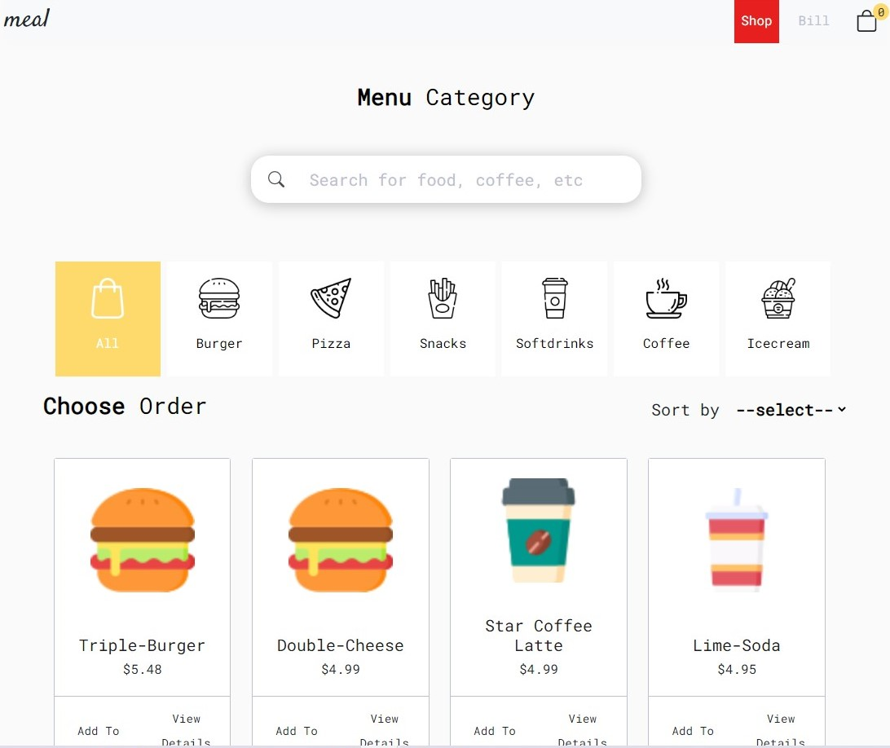
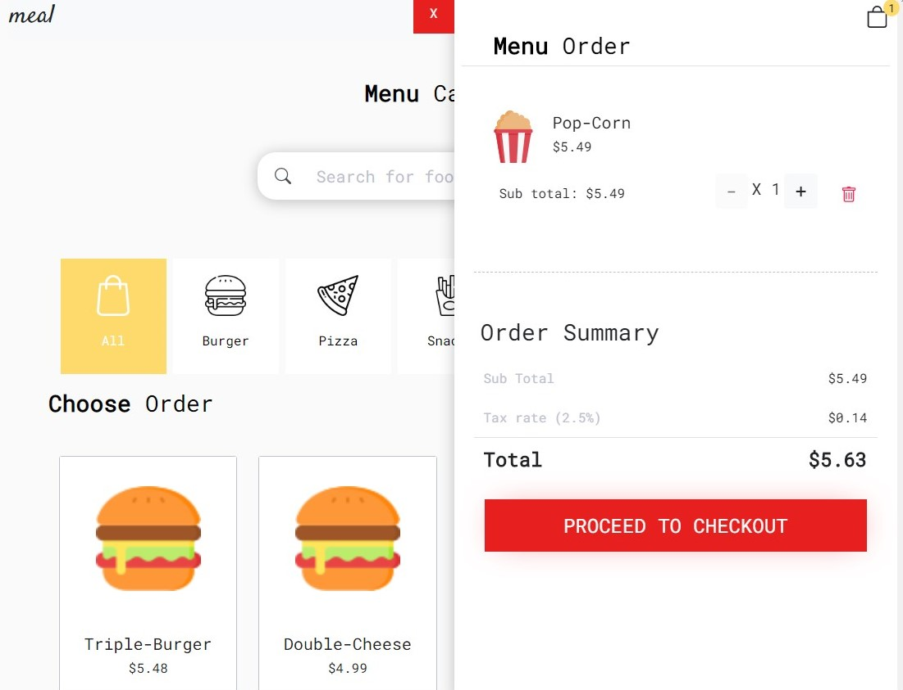
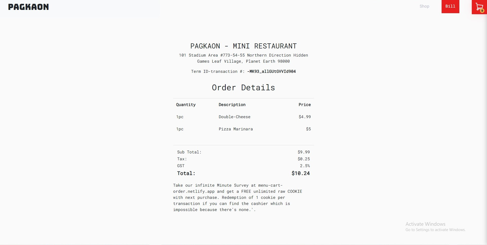

<p align="center">
	  
	  
	  
	  
</p>

## MEAL - ordering application

## Basic Overview - [Live Demo](https://menu-cart-order.netlify.app/)

I present to you my ordering application where customers select food then proceed to checkout and see the receipt instantly with complete details of the order.

My inspiration for this is a Japanese restaurant I visited months ago, In the restaurant, the customer order on the iPad (IPad already prepare on the table) then start ordering and that it.

The experience was simple and efficient no need for interaction with the waiter, so I decided to build this application to implement what I had experienced and to improve my skills on react.js and ecosystem, and I’m proud of it.

## Features

- [x] Add and remove products from the floating cart
- [x] Sort products
- [x] Search Bar
- [x] Filter products by category
- [x] Persist data on page reloads in particular float cart and transaction id
- [x] Firebase integration
- [x] Product cart notifier
- [x] Cart product quantity control ( increment and decrement )
- [ ] Responsive
- [ ] Customer can edit/update current order after checkout submission
- [ ] Customer can make payment
- [ ] User authentication
- [ ] Skeleton loader
- [ ] Soon: Unit tests, integration tests, all sort of test.

## Technology

- react
- create-react-app
- redux-toolkit
- persist-data
- react-router
- sass
- firebase

## How to use?

I used firebase real-time database for this application, make sure you have firebase set up locally or you can read the [docs](https://firebase.google.com/docs/web/setup) more for details. Make sure also you have the Node.js and NPM installed on your computer.

To run this repo locally you need to run the following command.
First, Install the needed packages

```
npm install
```

Then start create-react-app

```
npm start
```

## Contact

Are you interested in collaborating with me? At the moment I don't know about testing yet but it's already on my bucket list, so yeah if you have knowledge and experience at testing thingy I love talking to you send me an email at dev.json.stringify@gmail.com
